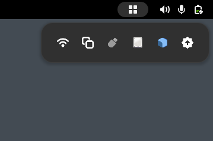

# Qubes Tray Widgets

Tray widgets for Qubes OS

## Details

This extension is just a wrapper for `qui-*` tray widgets for use on GNOME. See [qubes-desktop-linux-manager](https://github.com/QubesOS/qubes-desktop-linux-manager) for more information about the widgets.

## License

This project was inspired by and incorporates code from [tray-icons-reloaded](https://github.com/martinpl/tray-icons-reloaded), which is licensed under the [GPLv3](COPYING.tray-icons-reloaded).

